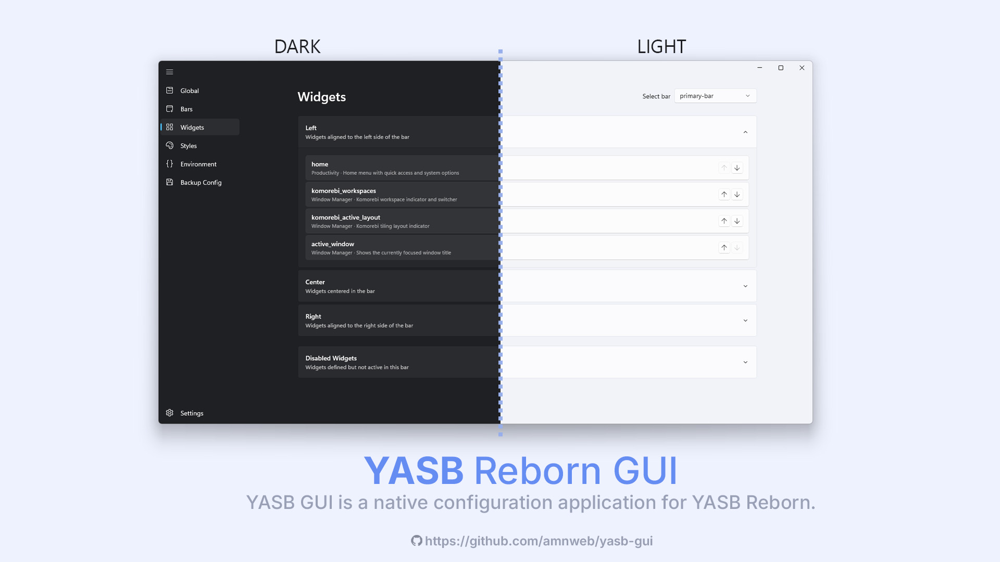

# YASB GUI

<p align="center">
  
</p>

**YASB GUI** is a native configuration application for [YASB Reborn](https://github.com/amnweb/yasb) (Yet Another Status Bar). Built with WinUI 3, it provides a modern interface for managing your status bar configuration without manually editing YAML files.

> **Note:** This application is currently in **beta**. Some features may be incomplete or subject to change. Please report any issues on the [GitHub Issues](https://github.com/amnweb/yasb-gui/issues) page.

**Why a separate repository?** 
- YASB GUI is maintained separately from YASB for several reasons:
- Built with WinUI 3, which requires Windows App SDK dependencies not needed by YASB itself
- Keeps YASB lightweight and focused on its core functionality without GUI framework bloat
- Allows independent development cycles and easier maintenance for both projects
- Users who prefer manual YAML editing don't need to install unnecessary GUI dependencies

---

<p align="center">
  <a href="https://opensource.org/licenses/MIT"></a>
  <a href="https://github.com/amnweb/yasb-gui"></a>
  <a href="https://github.com/amnweb/yasb-gui/issues"></a>
  <a href="https://github.com/amnweb/yasb-gui/releases"></a>
  <a href="https://github.com/amnweb/yasb-gui/releases/latest"></a>
  <a href="https://discord.gg/qkeunvBFgX" title="Discord"></a>
</p>

---

## Features

**Visual Configuration Editor**
- Edit bars, widgets, and global settings through an intuitive interface
- Monaco-based code editor with YAML syntax highlighting and validation
- Real-time schema validation for configuration files

**Widget Management**
- Add, remove, and configure widgets with a visual editor
- Support for all YASB widget types
- Widget-specific settings panels

**Styles Editor**
- Built-in CSS editor for customizing your status bar appearance
- Syntax highlighting and auto-completion

**Environment Variables**
- Manage environment variables used by YASB
- Easy key-value editing interface

**Application Settings**
- Light, Dark, and System theme support
- Multiple backdrop options: Mica, Mica Alt, and Acrylic
- Multi-language support

**Safety Features**
- Export configuration as ZIP backup
- Unsaved changes detection with confirmation dialogs
- Configuration validation before save

---

## System Requirements

| Component | Requirement |
|-----------|-------------|
| Operating System | Windows 10 (Build 17763+) or Windows 11 |
| Runtime | [Windows App SDK Runtime](https://learn.microsoft.com/en-us/windows/apps/windows-app-sdk/downloads) |
| WebView | Microsoft Edge WebView2 Runtime (included with Windows 10/11) |

---

## Installation

Download the latest release from the [Releases](https://github.com/amnweb/yasb-gui/releases) page.

### Add a widget using a docs snippet (how it actually works)
1) Go to **Widgets** → **Add Widget**.
2) Pick the widget from the built-in list.
3) In the **Options** editor, paste only the options block from the docs-not the outer `widgets:` list. Real example (Weather widget) with nested options and indentation kept:
```yaml
label: "<span>{icon}</span> {temp}"
label_alt: "{location}: Min {min_temp}, Max {max_temp}"
api_key: "YOUR_API_KEY"
show_alerts: true
tooltip: true
update_interval: 600
hide_decimal: true
units: metric
menu:
  blur: true
  round_corners: true
  round_corners_type: normal
  border_color: system
  alignment: center
  direction: down
  offset_top: 6
  offset_left: 0
icons:
  sunnyDay: "\ue30d"
  clearNight: "\ue32b"
  cloudyDay: "\ue312"
  cloudyNight: "\ue311"
  rainyDay: "\ue318"
  rainyNight: "\ue318"
  snowyIcy: "\ue31a"
  default: "\ue137"
callbacks:
  on_left: toggle_menu
```
4) Save the widget, then hit **Apply** so YASB reloads the updated config.

> **Tips**
>
> Copy only the options section from the docs and paste it into the Options editor; the widget type is already set by your selection.
>
> If indentation looks off, right-click in the editor and choose **Fix indentation** from the context menu.

---

## Configuration

The application reads and writes YASB configuration from:
- `~/.config/yasb/config.yaml`
- `~/.config/yasb/styles.css`

To use a custom location, set the `YASB_CONFIG_HOME` environment variable.

---

## Contributing Translations

YASB GUI supports multiple languages. Translation files are located in `app/core/locales/`.

**To add a new language:**
1. Copy `en.json` and rename it using the language code (e.g., `fr.json` for French)
2. Update `_language_name` and `_language_code` at the top of the file
3. Translate all string values while keeping the keys unchanged
4. Do not modify placeholders (e.g., `{variable}`) within the strings
5. Do not chnage the JSON structure
6. Submit a pull request

---

## Building from Source

### Development Setup
```bash
git clone https://github.com/amnweb/yasb-gui.git
cd yasb-gui
pip install -e .
python app/main.py
```

### Building Executable
```bash
pip install .[build]
python app/scripts/build.py build
```
The executable will be created in the `dist/` directory.

### Building MSIX Package
After building the executable, you can create an MSIX package:
```bash
python app/scripts/build_msix.py
```
The MSIX will be created in the `msix/` directory.

**Options:**
- `--arch x64|aarch64` - Target architecture (default: x64)
- `--output <path>` - Output directory for MSIX

### Local Development (Unsigned MSIX)
For local testing without code signing, register the package in development mode:
```powershell
# Register the package (runs from extracted layout, not the .msix file)
Add-AppxPackage -Path "msix/layout/AppxManifest.xml" -Register

# Launch the app
Start-Process "shell:AppsFolder\YASB.GUI_wbnnev551gwxy!App"

# Uninstall when done
Get-AppxPackage -Name "YASB.GUI" | Remove-AppxPackage
```

### Local Signing (Optional)
To test with a signed MSIX locally, create a self-signed certificate:
```powershell
# Create a self-signed certificate (run once)
$cert = New-SelfSignedCertificate -Type Custom -Subject "CN=YourName" `
  -KeyUsage DigitalSignature -FriendlyName "YASB GUI Dev" `
  -CertStoreLocation "Cert:\CurrentUser\My" `
  -TextExtension @("2.5.29.37={text}1.3.6.1.5.5.7.3.3")

# Export to PFX (set a password)
$pwd = ConvertTo-SecureString -String "YourPassword" -Force -AsPlainText
Export-PfxCertificate -Cert $cert -FilePath "dev-cert.pfx" -Password $pwd

# Trust the certificate (required to install signed packages)
Import-Certificate -FilePath (Export-Certificate -Cert $cert -FilePath "dev-cert.cer") `
  -CertStoreLocation "Cert:\LocalMachine\TrustedPeople"

# Sign the MSIX
& "C:\Program Files (x86)\Windows Kits\10\bin\10.0.22621.0\x64\signtool.exe" sign `
  /fd SHA256 /a /f "dev-cert.pfx" /p "YourPassword" "msix\yasb-gui-0.0.2-x64.msix"

# Install the signed MSIX
Add-AppxPackage -Path "msix\yasb-gui-0.0.2-x64.msix"
```

> **Note:** Update the Publisher in `build_msix.py` to match your certificate's CN if signing locally.

---

## Support the Project

If you find YASB GUI useful, consider supporting its development:

[](https://github.com/sponsors/amnweb)
[](https://ko-fi.com/amnweb)

Your support helps maintain and improve the project.